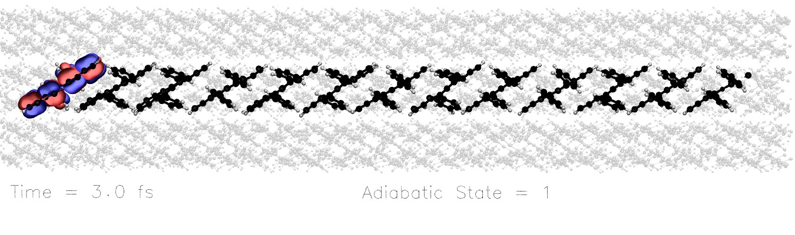
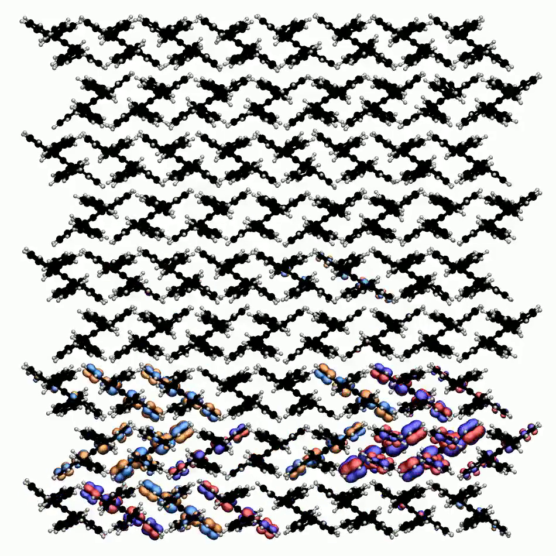

# Orbital Visualiser

**This code has only been tested on linux (Ubuntu, Fedora and RedHat)**

This project has been created to visualise the output of the Surface Hopping, Ehrenfest and CTMQC modules of CP2K. Full instructions can be found by initialising the HTML documentation.

To do this run the Create_docs.py file with python3 i.e:

` python3 Create_docs.py`

you can then open the newly created **Documentation.html** with your favourite browser. For example you could run the command:

`firefox Documentation.html`

This file should lead you through your first steps in visualising the output of your simulations.

Some examples of the output of this code to give you an idea of what it does are below!

#### A video of charge transport along a Rubrene Chain at 100K.

#### A video of charge transport on a 2D Rubrene Plane.

#### A still of an Anthracene dimer

TODO:
====

+ Add feature to use last timestep in calibration

+ Would like to clean up the files, improve code structure. Read the docstrings on top of files and carry out what they say.

+ Add a testing code!

+ I've added a TACHYON_LINUXAND64 binary. Would like to just use this instead of finding the binary on the computer. I should test if this will work on other OS's -maybe need a windows and mac OS one too? Also could compile a better version which supports rendering straight to png.

+ Add and test support for visualising replicas

+ Finish the pvecs calculator. It works for ethylene but needs to work in general.

+ Try parallelising again! (maybe this means only parallelising the python part and not the VMD part)

+ Add support for other rendering engines e.g. Jmol, pymol etc...
