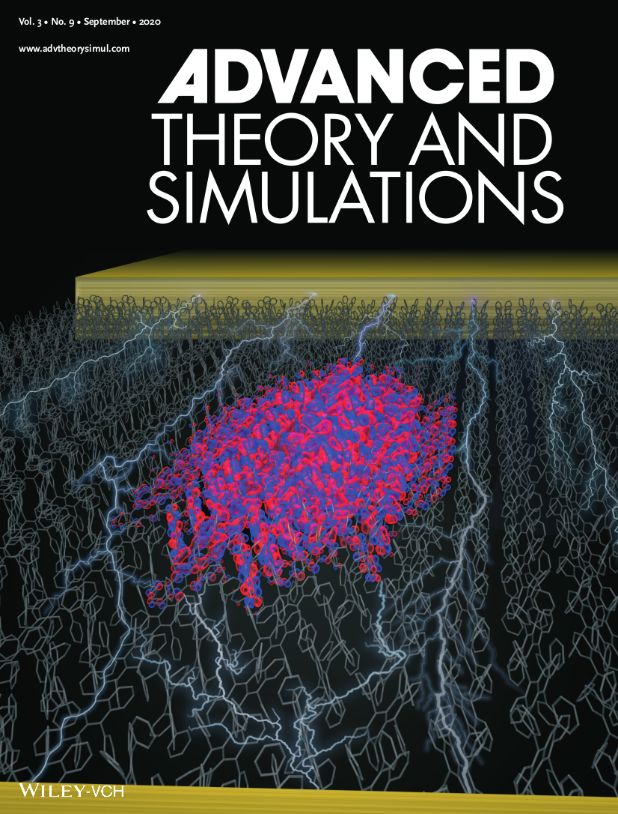

# Orbital Visualiser

**This code has only been tested on linux (Ubuntu, Fedora and RedHat)**

This project has been created to visualise the output of the Surface Hopping module of CP2K. Full instructions can be found by initialising the HTML documentation.

To do this run the Create_docs.py file with python3 or python2 i.e:

` python3 Create_docs.py`

you can then open the newly created **Documentation.html** with your favourite browser. For example you could run the command:

`firefox Documentation.html &`

This file should lead you through your first steps in visualising the output of your simulations as well as providing some examples.

#### A video of charge transport along a Rubrene Chain at 100K.

#### A video of charge transport on a 2D Rubrene Plane.

#### The front cover of the journal: Advanced Theory and Simulations

TODO:
====

+ Add option to visualise general orbitals. E.g. visualise sulphur with it's s orbital and maybe transition metal with their funky d ones... Need to have a general AOM_COEFFICIENT reader.

+ Add more tests in code!

+ I've added a TACHYON_LINUXAND64 binary. Would like to just use this instead of finding the binary on the computer. Also could compile a better version which supports rendering straight to png.

+ Add and test support for visualising replicas

+ Finish the pvecs calculator. It works for ethylene but needs to work in general.

+ Try parallelising again! (maybe this means only parallelising the python part and not the VMD part)

+ Add support for other rendering engines e.g. Jmol, pymol etc... (maybe learn how to implement own openGL renderer -might be quite a big task!)
