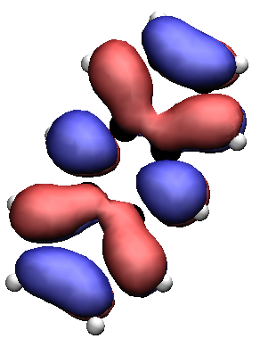

# Orbital Visualiser

**This code has only been tested on linux (Ubuntu, Fedora and RedHat)**

This project has been created to visualise the output of the Surface Hopping, Ehrenfest and CTMQC modules of CP2K. Full instructions can be found by initialising the HTML documentation.

To do this run the Create_docs.py file with python3 i.e:

` python3 Create_docs.py`

you can then open the newly created **Documentation.html** with your favourite browser. For example you could run the command:

`firefox Documentation.html &`

This file should lead you through your first steps in visualising the output of your simulations as well as providing some examples.

#### A video of charge transport along a Rubrene Chain at 100K.

#### A video of charge transport on a 2D Rubrene Plane.

#### A still of an Anthracene dimer

TODO:
====

+ Add feature to use last timestep in calibration and change how the code handles the user inputting a higher number of timesteps than there are. E.g. if # timsteps in file = 200 and user enters 2000 then currently the code crashes. I would like it to just let the user know and use as many steps as it can.

+ Add option to visualise general orbitals. E.g. visualise sulphur with it's s orbital and maybe transition metal with their funky d ones... Need to have a general AOM_COEFFICIENT reader.

+ Add feature to use last timestep in calibration

+ Optimise the nearest neighbour list by comparing data with the nearest neighbour to data with fewer neighbours. If the data with fewer neighbours is very similar then set the nearest neighbour list to that. (similar to the min_abs_coeff optimisation)

+ Add more tests in code!

+ I've added a TACHYON_LINUXAND64 binary. Would like to just use this instead of finding the binary on the computer. Also could compile a better version which supports rendering straight to png.

+ Add and test support for visualising replicas

+ Finish the pvecs calculator. It works for ethylene but needs to work in general.

+ Try parallelising again! (maybe this means only parallelising the python part and not the VMD part)

+ Add support for other rendering engines e.g. Jmol, pymol etc... (maybe learn/implement own openGL renderer -might be quite a big task!)
